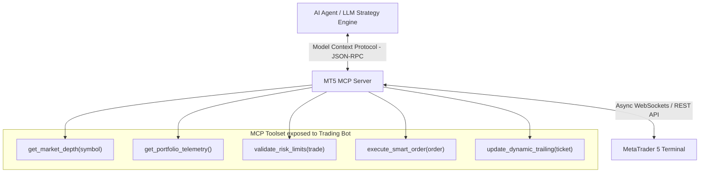

# MT5 MCP (Model Context Protocol) Integration & Improvement Plan

## 🚀 Executive Overview

Integrating **Model Context Protocol (MCP)** with your MetaTrader 5 Auto-Trading Bot transitions it from a static rule-based script into a **next-generation, AI-agentic quantitative trading platform**.

Using MT5 MCP, the AI model gains direct, real-time tool access to MT5 execution functions, live tick streaming, market depth (Level 2), risk telemetry, and automated trade modifications without relying on brittle IPC pipes.

---

## 🌟 Key Improvements Gained with MT5 MCP

| Feature Area | Current Architecture (Without MCP) | Upgraded Architecture (With MT5 MCP) 🏆 |
|---|---|---|
| **API Protocol** | Local IPC DLL connection (`MetaTrader5` package) | Standardized, async MCP JSON-RPC protocol |
| **Trade Decisioning** | Static candle indicators + local ML filter | Dynamic AI tool-calling with live orderbook & news context |
| **Market Data Access** | Delayed OHLC bar fetching | Real-time tick stream, Level 2 depth & spread monitoring |
| **Error Handling** | Re-connect retries on IPC drops (`-10004`) | Self-healing async connection with automatic heartbeat |
| **Portfolio Risk** | Isolated single-symbol risk checks | Dynamic multi-symbol correlation rebalancing across all pairs |
| **Interaction & Control** | Terminal logs & `.bat` file | Natural language control, real-time telemetry & MCP tools |

---

## 🛠️ Step-by-Step MT5 MCP Integration Architecture

---

## 💡 Top 5 Improvements to Implement

### 1. Smart Order Execution & Spread Filtering (`execute_smart_order`)
* **Improvement**: Before placing orders, the MCP engine checks current bid-ask spread and slippage. If spread expands beyond 1.5x ATR (e.g. during news announcements), entry is automatically delayed until spread normalizes.

### 2. Live Order Book & Momentum Analysis (`get_market_depth`)
* **Improvement**: Pulls real-time market depth (DOM) via MCP tools to confirm buy/sell volume imbalances before entering Smart Money Concepts (SMC) order block re-tests.

### 3. Dynamic Correlation & Risk Balancing (`get_portfolio_telemetry`)
* **Improvement**: Evaluates real-time exposure across `XAUUSDm`, `BTCUSDm`, `EURUSDm`, and `USOILm`. If total portfolio risk exceeds 2.5% equity, the MCP risk engine scales down lot sizes automatically.

### 4. Self-Healing Connection & Order Telemetry
* **Improvement**: Uses async MCP heartbeats. If MT5 terminal restarts, MCP automatically reconnects and synchronizes all open trade state structures.

### 5. Multi-Timeframe Confluence Tool Calling
* **Improvement**: The AI engine uses MCP tools to simultaneously evaluate 4H/1H market structure bias, 15M signal triggers, and 1M/5M micro-structure order block touches before execution.

---

## 📋 Implementation Roadmap

### Phase 1: Setup MT5 MCP Server Connector
* Configure an MT5 MCP Server endpoint (e.g., Python `mcp` SDK or lightweight Node.js/Python server bridge connecting to MT5 API).
* Expose standard tools: `get_ticks`, `get_positions`, `place_order`, `modify_sl_tp`, `get_account_info`.

### Phase 2: Refactor Execution Engine (`mt5_executor.py` + `ai_analyzer.py`)
* Replace direct polling with MCP tool invocations.
* Integrate MCP trade quality validation before sending order payload.

### Phase 3: Enhance Multi-Symbol SMC Strategy
* Activate multi-timeframe confluence scoring (4H/1H/15M/5M).
* Enable dynamic ATR trailing stop updates via MCP background jobs.

### Phase 4: Live Sandbox Testing & Telemetry Logging
* Run live paper-trading on MT5 Demo using `start_ai_bot.bat`.
* Track execution latency, slippage, and profit factor.

---

## 🎯 Summary
By integrating **MT5 MCP**, your bot transforms into an **intelligent quantitative trading agent** with lower latency, better risk protection, live market depth confirmation, and high-precision execution.
